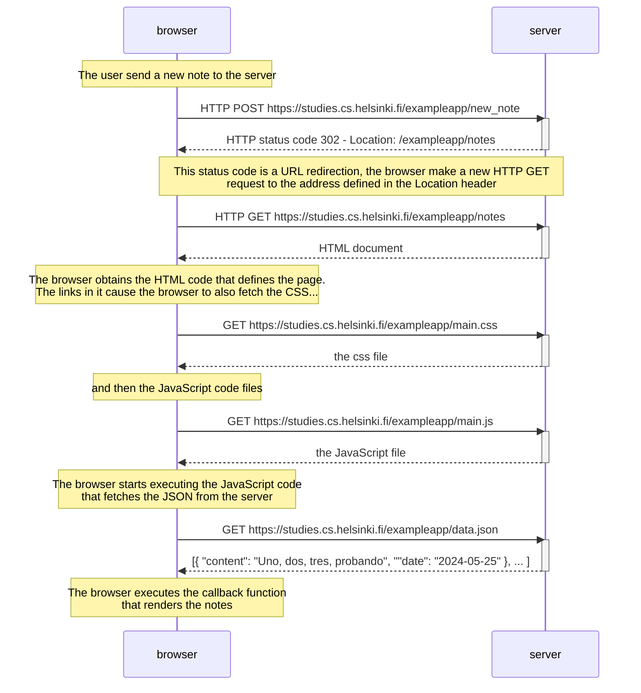

```mermaid
sequenceDiagram
    Note over browser: The user send a new note to the server
    participant browser
    participant server
    browser->>server: HTTP POST https://studies.cs.helsinki.fi/exampleapp/new_note
    activate server
    server-->>browser: HTTP status code 302 - Location: /exampleapp/notes
    deactivate server
    Note over browser,server: This status code is a URL redirection, the browser  make a new HTTP GET<br> request to the address defined in the Location header
    
    browser->>server: HTTP GET https://studies.cs.helsinki.fi/exampleapp/notes
    activate server
    server-->>browser: HTML document
    deactivate server
    Note over browser: The browser obtains the HTML code that defines the page.<br> The links in it cause the browser to also fetch the CSS...

    browser->>server: GET https://studies.cs.helsinki.fi/exampleapp/main.css
    activate server
    server-->>browser: the css file
    deactivate server
    Note over browser: and then the JavaScript code files

    browser->>server: GET https://studies.cs.helsinki.fi/exampleapp/main.js
    activate server
    server-->>browser: the JavaScript file
    deactivate server
    Note over browser: The browser starts executing the JavaScript code<br> that fetches the JSON from the server

    browser->>server: GET https://studies.cs.helsinki.fi/exampleapp/data.json
    activate server
    server-->>browser: [{ "content": "Uno, dos, tres, probando", ""date": "2024-05-25" }, ... ]
    deactivate server

    Note over browser: The browser executes the callback function<br> that renders the notes
```