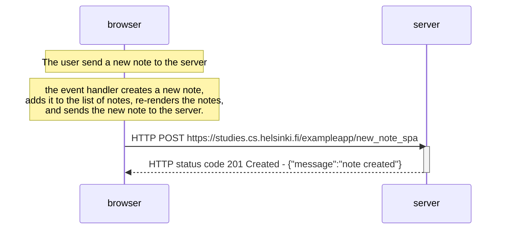

```mermaid
sequenceDiagram
    participant browser
    participant server

    Note over browser: The user send a new note to the server

    Note over browser: the event handler creates a new note,<br> adds it to the list of notes, re-renders the notes,<br>and sends the new note to the server.

    browser->>server: HTTP POST https://studies.cs.helsinki.fi/exampleapp/new_note_spa
    activate server
    server-->>browser: HTTP status code 201 Created - {"message":"note created"}
    deactivate server

```